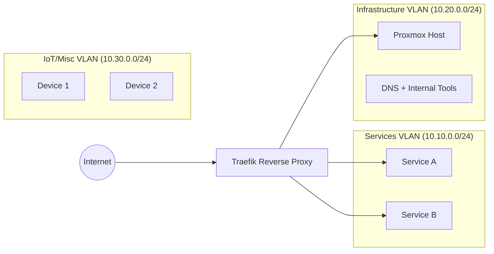

# **DevOps / SRE Portfolio**

A curated collection of infrastructure projects demonstrating practical experience in Linux systems, containerization, reverse proxy configuration, basic orchestration, and foundational DevOps concepts including CI/CD and Infrastructure-as-Code.

This repository provides an overview of a reproducible homelab environment designed to simulate real-world cloud and on-premise operations using lightweight, secure, and modular components.

---

## **Repository Structure**

```
devops-portfolio/
│
├── docker/
│   ├── reverse-proxy/         # Traefik + Certificates + Routing
│   ├── services/              # Example web services
│   └── databases/             # Example DB containers
│
├── terraform/
│   └── aws-ec2-lab/           # IaC mock project (EC2 + Security Groups)
│
├── cicd/
│   └── github-actions/        # CI/CD pipeline examples
│
└── docs/
    └── architecture.md        # Documentation
```

---

# **Homelab Architecture**

The homelab emulates a small-scale production environment with isolated networks, containerized services, and a reverse proxy managing secure routing.

### **Architecture Diagram**



---

# **Technologies Used**

### **Core Infrastructure**

* **Linux** (server administration, systemd, networking basics)
* **Docker**, Docker Compose
* **Proxmox** (VM/LXC orchestration, segmentation, template management)
* **Traefik** (reverse proxy, TLS, dynamic routing)

### **DevOps Foundations**

* **Git & GitHub**
* **CI/CD basics** with GitHub Actions
* **Infrastructure-as-Code basics** with **Terraform**
* **Networking**: VLANs, segmentation, routing, SSL/TLS, DNS, port forwarding
* **Monitoring**: lightweight tools and log inspection

### **Scripting & Development**

* **Bash**
* **Python**
* **Kotlin/Java** (background from Android and backend fundamentals)

---

# **Docker Stack Example**

```yaml
services:
  webapp:
    image: nginx:alpine
    container_name: webapp
    labels:
      - "traefik.enable=true"
      - "traefik.http.routers.webapp.rule=Host(`web.example.local`)"
      - "traefik.http.routers.webapp.entrypoints=websecure"
    networks:
      - services

  db:
    image: postgres:16
    environment:
      POSTGRES_USER: app
      POSTGRES_PASSWORD: secret
    volumes:
      - dbdata:/var/lib/postgresql/data
    networks:
      - services

networks:
  services:
    driver: bridge

volumes:
  dbdata:
```

---

# **Terraform Lab Example**

```hcl
provider "aws" {
  region = "eu-west-1"
}

resource "aws_instance" "lab_vm" {
  ami           = "ami-0c02fb55956c7d316"
  instance_type = "t3.micro"

  tags = {
    Name = "DevOps-Lab-VM"
  }
}

output "public_ip" {
  value = aws_instance.lab_vm.public_ip
}
```

---

# **CI/CD Example — GitHub Actions**

```yaml
name: Build and Deploy

on:
  push:
    branches: [ "main" ]

jobs:
  build:
    runs-on: ubuntu-latest

    steps:
      - name: Checkout repo
        uses: actions/checkout@v3

      - name: Build Docker image
        run: docker build -t demo-app .

      - name: Run tests
        run: echo "Running example tests..."

  deploy:
    needs: build
    runs-on: ubuntu-latest

    steps:
      - name: Deploy to server (mock)
        run: |
          echo "Deploying..."
          # Here you would normally use SSH or rsync to push artifacts
```

---

# **Key Learning Outcomes**

* Hands-on understanding of container orchestration and service isolation
* Practical exposure to reverse proxies and secure routing
* Foundations of CI/CD, automation, and IaC workflows
* Experience with virtualization and network segmentation
* Ability to structure infrastructure projects in a reproducible way

---

# **Disclaimer**

This repository provides **mock examples** and **representative configurations**.
No private services, sensitive configurations, or real network data are included.
